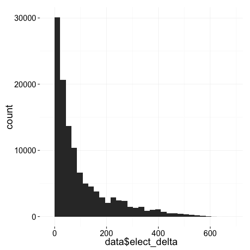
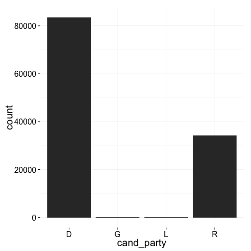

Exploring 2012 Presidential Campaign Contributions in Ohio by Aaron Rank
========================================================


```r
library(ggplot2)
library(reshape2)
library(plyr)
library(dplyr)
library(lubridate)
library(Hmisc)
library(jsonlite) #http://stackoverflow.com/questions/2061897/parse-json-with-r
library(zoo)
require(scales)
require(stringr)

theme_set(theme_minimal(20))
```

#http://cran.r-project.org/web/packages/gender/vignettes/predicting-gender.html
# Analysis

## Question - What is the probability that someone will vote either Democrat or Republican?

### Load the Data


```r
data <- read.csv('~/projects/udacity_DataR/P00000001-OH.csv', sep=',',row.names=NULL)
head(data)
```

```
##   row.names   cmte_id      cand_id               cand_nm       contbr_nm
## 1 C00431171 P80003353 Romney, Mitt SMITH, STEPHEN C. MR.         FINDLAY
## 2 C00431171 P80003353 Romney, Mitt SMITH, STEPHEN C. MR.         FINDLAY
## 3 C00431171 P80003353 Romney, Mitt         SMITH, TRAVIS UPPER ARLINGTON
## 4 C00431171 P80003353 Romney, Mitt      STEINER, GREGORY         WOOSTER
## 5 C00431171 P80003353 Romney, Mitt     SUPRENANT, ALBERT          DAYTON
## 6 C00431171 P80003353 Romney, Mitt          SUTTER, ERIC      NEW ALBANY
##   contbr_city contbr_st     contbr_zip   contbr_employer contbr_occupation
## 1          OH 458406817 AQUA-LINE INC.    BUSINESS OWNER                50
## 2          OH 458406817 AQUA-LINE INC.    BUSINESS OWNER                50
## 3          OH 432213322        HMI INC             SALES               100
## 4          OH 446917442    FLIGHT BOSS        FABRICATOR               250
## 5          OH 454589145    THE LIMITED FINANCIAL ANALYST               250
## 6          OH 430548100         CERNER             SALES               100
##   contb_receipt_amt contb_receipt_dt receipt_desc memo_cd memo_text
## 1         13-AUG-12                                           SA17A
## 2         23-AUG-12                                           SA17A
## 3         23-AUG-12                                           SA17A
## 4         09-AUG-12                                           SA17A
## 5         29-AUG-12                                           SA17A
## 6         06-AUG-12                                           SA17A
##   form_tp     file_num tran_id election_tp
## 1  896743 SA17.1995556   P2012          NA
## 2  896743 SA17.2184389   P2012          NA
## 3  896743 SA17.2147759   G2012          NA
## 4  896743 SA17.1850253   P2012          NA
## 5  896743 SA17.2253693   G2012          NA
## 6  896743 SA17.1793975   P2012          NA
```

```r
colnames(data)[1:18] <- colnames(data)[2:19]
data <- data[1:18]
pops <- fromJSON('~/projects/udacity_DataR/ohio_city_populations.json') # census data
data$population <- sapply(data$contbr_city,function(x) { 
  ifelse(x %in% names(pops),return(pops[as.character(x)]),return(NA))
  }) # returns a list

data$population <- as.numeric(data$population) # I only want the population values

data$contb_receipt_dt <- as.Date(data$contb_receipt_dt, "%d-%b-%y")
election_day <- as.Date("2012-11-06")
data$elect_delta <- sapply(data$contb_receipt_dt,function(x) {return(election_day - x)}) # days from general election day
data$contbr_zip <- substr(as.character(as.integer(data$contbr_zip)),1,5) # zip codes should be treated as categorical variables and I want to limit it to the main 5 digit zip code without the additional information


cand_party = list()    
for (cand in unique(data$cand_nm)){
   if(cand == 'Obama, Barack'){
    cand_party['Obama, Barack'] <- 'D'
  }     
  else if(cand == 'Stein, Jill'){
    cand_party['Stein, Jill'] <- 'G'
  } else if(cand == 'Johnson, Gary Earl'){
    cand_party['Johnson, Gary Earl'] <- 'L'
  } else{
    cand_party[as.character(cand)] <- 'R'
  }
}
data$cand_party <- sapply(as.character(data$cand_nm), function(x) {as.character(cand_party[x])})

data$contb_bins <- cut(data$contb_receipt_amt,breaks=c(0,50,100,250,500,1000,1500,2500,3500,15000))
data$pop_bins <- cut(data$population, breaks=c(0,5000,25000,50000,100000,500000,1000000))
data$elect_delta_bins <- cut(data$elect_delta,breaks=c(0,7,14,30,90,180,365,700,1500))
data <- subset(data,contb_receipt_amt >0) # I'm not concerned with negative donations - I'm not really sure what they mean 
data <- na.omit(data) # there are 100k+ rows and it's exploratory analysis so I'm going to just going to drop all NAs - if I wanted to publish my analysis or put it into "production", I would revisit the NAs to ensure they were random as opposed to systematic. Though, I guess it could be argued that understanding if NAs are random or systematic could be considered part of EDA. 

dem <- subset(data, cand_party == 'D')
rep <- subset(data, cand_party == 'R')
```
The dataset had each column name shifted to the right one place with an additional column at the end filled with NAs. I renamed the columns and dropped the last column.

### Summary of the Data Set

```r
dim(data)
```

```
## [1] 117900     24
```

```r
names(data)
```

```
##  [1] "cmte_id"           "cand_id"           "cand_nm"          
##  [4] "contbr_nm"         "contbr_city"       "contbr_st"        
##  [7] "contbr_zip"        "contbr_employer"   "contbr_occupation"
## [10] "contb_receipt_amt" "contb_receipt_dt"  "receipt_desc"     
## [13] "memo_cd"           "memo_text"         "form_tp"          
## [16] "file_num"          "tran_id"           "election_tp"      
## [19] "population"        "elect_delta"       "cand_party"       
## [22] "contb_bins"        "pop_bins"          "elect_delta_bins"
```

```r
str(data)
```

```
## 'data.frame':	117900 obs. of  24 variables:
##  $ cmte_id          : chr  "C00431171" "C00431171" "C00431171" "C00431171" ...
##  $ cand_id          : Factor w/ 14 levels "P00003608","P20002523",..: 14 14 14 14 14 14 14 14 14 14 ...
##  $ cand_nm          : Factor w/ 14 levels "Bachmann, Michele",..: 12 12 12 12 12 12 12 12 12 12 ...
##  $ contbr_nm        : Factor w/ 35431 levels "`SCHMIDT, MICHELLE",..: 29547 29547 29569 30271 30906 30932 31607 31632 32214 32231 ...
##  $ contbr_city      : Factor w/ 1167 levels ":POLAND","`LOVELAND",..: 349 349 1042 1151 286 702 1161 198 243 175 ...
##  $ contbr_st        : Factor w/ 1 level "OH": 1 1 1 1 1 1 1 1 1 1 ...
##  $ contbr_zip       : chr  "22872" "22872" "4005" "14191" ...
##  $ contbr_employer  : Factor w/ 13509 levels "","(SELF) GREEN LEAF LAWN CARE",..: 721 721 5322 4292 11701 1942 5654 9736 9834 9834 ...
##  $ contbr_occupation: Factor w/ 6846 levels "","-","100% DISABLED VIETNAM VETERAN",..: 712 712 5488 2237 2345 5488 2975 453 5237 5237 ...
##  $ contb_receipt_amt: num  50 50 100 250 250 100 100 200 100 300 ...
##  $ contb_receipt_dt : Date, format: "2012-08-13" "2012-08-23" ...
##  $ receipt_desc     : Factor w/ 16 levels "","REATTRIBUTED",..: 1 1 1 1 1 1 1 1 1 1 ...
##  $ memo_cd          : Factor w/ 2 levels "","X": 1 1 1 1 1 1 1 1 1 1 ...
##  $ memo_text        : Factor w/ 81 levels "","*","* EARMARKED CONTRIBUTION: SEE BELOW",..: 1 1 1 1 1 1 1 1 1 1 ...
##  $ form_tp          : Factor w/ 3 levels "SA17A","SA18",..: 1 1 1 1 1 1 1 1 1 1 ...
##  $ file_num         : int  896743 896743 896743 896743 896743 896743 896743 896743 896743 896743 ...
##  $ tran_id          : Factor w/ 129307 levels "0000018","0000074",..: 100963 101685 101543 100633 101874 100365 100736 101658 101214 100932 ...
##  $ election_tp      : Factor w/ 7 levels "","G2008","G2012",..: 7 7 3 7 3 7 7 3 7 7 ...
##  $ population       : num  41512 41512 34420 26384 143355 ...
##  $ elect_delta      : num  85 75 75 89 69 92 88 73 81 85 ...
##  $ cand_party       : chr  "R" "R" "R" "R" ...
##  $ contb_bins       : Factor w/ 9 levels "(0,50]","(50,100]",..: 1 1 2 3 3 2 2 3 2 4 ...
##  $ pop_bins         : Factor w/ 6 levels "(0,5e+03]","(5e+03,2.5e+04]",..: 3 3 3 3 5 2 4 5 6 1 ...
##  $ elect_delta_bins : Factor w/ 8 levels "(0,7]","(7,14]",..: 4 4 4 4 4 5 4 4 4 4 ...
##  - attr(*, "na.action")=Class 'omit'  Named int [1:10195] 53 54 55 56 61 62 75 83 112 131 ...
##   .. ..- attr(*, "names")= chr [1:10195] "53" "54" "55" "56" ...
```

```r
summary(data) # many variables make it difficult to grok the data
```

```
##    cmte_id               cand_id                cand_nm     
##  Length:117900      P80003338:83602   Obama, Barack :83602  
##  Class :character   P80003353:25847   Romney, Mitt  :25847  
##  Mode  :character   P80000748: 3870   Paul, Ron     : 3870  
##                     P20002721: 1816   Santorum, Rick: 1816  
##                     P60003654: 1269   Gingrich, Newt: 1269  
##                     P00003608:  529   Cain, Herman  :  529  
##                     (Other)  :  967   (Other)       :  967  
##              contbr_nm          contbr_city    contbr_st  
##  WADE, ANNIE SANDS:   108   CINCINNATI:15785   OH:117900  
##  DUPHIL, MONIQUE  :    99   COLUMBUS  :12393              
##  POWERS, KAREN    :    89   DAYTON    : 4720              
##  KNEELAND, HAROLD :    88   CLEVELAND : 4346              
##  SCHUMAN, REBECCA :    84   TOLEDO    : 2911              
##  CRAWFORD, LELA   :    78   AKRON     : 2523              
##  (Other)          :117354   (Other)   :75222              
##   contbr_zip                                      contbr_employer 
##  Length:117900      RETIRED                               :26315  
##  Class :character   SELF-EMPLOYED                         : 9282  
##  Mode  :character   NOT EMPLOYED                          : 8060  
##                     INFORMATION REQUESTED                 : 3901  
##                     INFORMATION REQUESTED PER BEST EFFORTS: 3291  
##                     HOMEMAKER                             : 1902  
##                     (Other)                               :65149  
##                               contbr_occupation contb_receipt_amt
##  RETIRED                               :29882   Min.   :    1.0  
##  INFORMATION REQUESTED                 : 3549   1st Qu.:   25.0  
##  PHYSICIAN                             : 3388   Median :   50.0  
##  ATTORNEY                              : 3363   Mean   :  181.8  
##  HOMEMAKER                             : 3320   3rd Qu.:  100.0  
##  INFORMATION REQUESTED PER BEST EFFORTS: 3143   Max.   :10000.0  
##  (Other)                               :71255                    
##  contb_receipt_dt                                      receipt_desc   
##  Min.   :2011-01-28                                          :117616  
##  1st Qu.:2012-06-25   REDESIGNATION FROM PRIMARY             :   124  
##  Median :2012-09-10   REATTRIBUTION FROM SPOUSE              :    53  
##  Mean   :2012-07-28   SEE REATTRIBUTION                      :    47  
##  3rd Qu.:2012-10-16   REATTRIBUTION / REDESIGNATION REQUESTED:    31  
##  Max.   :2012-11-05   REDESIGNATION FROM GENERAL             :    12  
##                       (Other)                                :    17  
##  memo_cd                                 memo_text      form_tp     
##   :89849                                      :89521   SA17A:90068  
##  X:28051   * OBAMA VICTORY FUND 2012          :17069   SA18 :27832  
##            TRANSFER FROM ROMNEY VICTORY INC.  :10722   SB28A:    0  
##            * EARMARKED CONTRIBUTION: SEE BELOW:  125                
##            REDESIGNATION FROM PRIMARY         :  124                
##            REATTRIBUTION FROM SPOUSE          :   53                
##            (Other)                            :  286                
##     file_num             tran_id       election_tp     population    
##  Min.   :723511   SA17.29990 :     2        :    6   Min.   :    77  
##  1st Qu.:876050   SA17.755938:     2   G2008:    0   1st Qu.: 13837  
##  Median :896785   SA17.759449:     2   G2012:64343   Median : 37530  
##  Mean   :879785   SA17.788103:     2   O2012:    0   Mean   :172459  
##  3rd Qu.:897086   SA17.798431:     2   P    :    7   3rd Qu.:297517  
##  Max.   :921959   SA17.826859:     2   P2008:    0   Max.   :822553  
##                   (Other)    :117888   P2012:53544                   
##   elect_delta   cand_party                    contb_bins   
##  Min.   :  1   Length:117900      (0,50]           :64013  
##  1st Qu.: 21   Class :character   (50,100]         :25853  
##  Median : 57   Mode  :character   (100,250]        :15638  
##  Mean   :100                      (250,500]        : 5940  
##  3rd Qu.:134                      (1.5e+03,2.5e+03]: 3029  
##  Max.   :648                      (500,1e+03]      : 2855  
##                                   (Other)          :  572  
##             pop_bins      elect_delta_bins
##  (0,5e+03]      :12466   (30,90]  :37603  
##  (5e+03,2.5e+04]:33350   (90,180] :19498  
##  (2.5e+04,5e+04]:23514   (14,30]  :17992  
##  (5e+04,1e+05]  : 5892   (180,365]:16708  
##  (1e+05,5e+05]  :30285   (0,7]    :10606  
##  (5e+05,1e+06]  :12393   (7,14]   :10214  
##                          (Other)  : 5279
```

```r
describe(data)
```

```
## data 
## 
##  24  Variables      117900  Observations
## ---------------------------------------------------------------------------
## cmte_id 
##       n missing  unique 
##  117900       0      15 
## 
##           C00410118 C00431171 C00431445 C00493692 C00494393 C00495622
## Frequency        12     25847     83602       142        58       115
## %                 0        22        71         0         0         0
##           C00495820 C00496034 C00496067 C00496497 C00497511 C00498220
## Frequency      3870      1816       529      1269       401         9
## %                 3         2         0         1         0         0
##           C00498444 C00500587 C00505800
## Frequency        41       152        37
## %                 0         0         0
## ---------------------------------------------------------------------------
## cand_id 
##       n missing  unique 
##  117900       0      14 
## 
##           P00003608 P20002523 P20002556 P20002671 P20002721 P20002978
## Frequency       529       142        58       115      1816       413
## %                 0         0         0         0         2         0
##           P20003067 P20003109 P20003281 P20003984 P60003654 P80000748
## Frequency        41         9       152        37      1269      3870
## %                 0         0         0         0         1         3
##           P80003338 P80003353
## Frequency     83602     25847
## %                71        22
## ---------------------------------------------------------------------------
## cand_nm 
##       n missing  unique 
##  117900       0      14 
## 
## Bachmann, Michele (413, 0%) 
## Cain, Herman (529, 0%), Gingrich, Newt (1269, 1%) 
## Huntsman, Jon (41, 0%) 
## Johnson, Gary Earl (115, 0%) 
## McCotter, Thaddeus G (9, 0%) 
## Obama, Barack (83602, 71%) 
## Paul, Ron (3870, 3%), Pawlenty, Timothy (58, 0%) 
## Perry, Rick (152, 0%) 
## Roemer, Charles E. 'Buddy' III (142, 0%) 
## Romney, Mitt (25847, 22%) 
## Santorum, Rick (1816, 2%), Stein, Jill (37, 0%) 
## ---------------------------------------------------------------------------
## contbr_nm 
##       n missing  unique 
##  117900       0   32592 
## 
## lowest : `SCHMIDT, MICHELLE     AARDEMA, CHARLES       AARON, LOIS A          AARON, MARJORIE C.     AASBO, ABBY           
## highest: ZWEIBEL, ANNE M.       ZWELLING, HOWARD S.    ZWOLINSKI, BRETT A MR. ZYCH, THOMAS           ZYP, VICTORIA          
## ---------------------------------------------------------------------------
## contbr_city 
##       n missing  unique 
##  117900       0     624 
## 
## lowest : ADA            ADDYSTON       ADENA          AKRON          ALBANY        
## highest: WYOMING        XENIA          YELLOW SPRINGS YOUNGSTOWN     ZANESVILLE     
## ---------------------------------------------------------------------------
## contbr_st 
##       n missing  unique   value 
##  117900       0       1      OH 
## ---------------------------------------------------------------------------
## contbr_zip 
##       n missing  unique 
##  117900       0   21263 
## 
## lowest : 1     10000 10001 10002 10003
## highest: 9995  9996  9997  9998  9999  
## ---------------------------------------------------------------------------
## contbr_employer 
##       n missing  unique 
##  117900       0   12522 
## 
## lowest :                                       (SELF) GREEN LEAF LAWN CARE           (SELF) STATE FARM INSURANCE COMPANIES 1 EDI SOURCE, INC                     1 FINANCIAL CORPORATION              
## highest: ZOLMET TECHNOLOGIES INC.              ZOO GAMES INC.                        ZUCKERMAN CONSULTING GROUP, INC.      ZUKERMAN DAIKER & LEAR                ZUKERMAN DAIKER LEAR                  
## ---------------------------------------------------------------------------
## contbr_occupation 
##       n missing  unique 
##  117900       0    6390 
## 
## lowest :                                        -                                      100% DISABLED VIETNAM VETERAN          100% SERVICE CONNECTED DISABLED VIETNA 2101 AIRWAY TRANSPORTATION SYSTEM SPEC
## highest: YOUTH MINISTRY AND ADVOCACY            YOUTH MINISTRY LEADER                  YOUTH SERVICES                         YOUTH SERVICES ASSOCIATE               ZONE BUSINESS MANAGER                  
## ---------------------------------------------------------------------------
## contb_receipt_amt 
##       n missing  unique    Info    Mean     .05     .10     .25     .50 
##  117900       0    1295    0.99   181.8      10      14      25      50 
##     .75     .90     .95 
##     100     300    1000 
## 
## lowest :     1.00     1.42     1.50     1.62     2.00
## highest:  4000.00  4685.00  4900.00  5000.00 10000.00 
## ---------------------------------------------------------------------------
## contb_receipt_dt 
##       n missing  unique 
##  117900       0     590 
## 
## lowest : 2011-01-28 2011-03-02 2011-03-04 2011-03-06 2011-03-07
## highest: 2012-11-01 2012-11-02 2012-11-03 2012-11-04 2012-11-05 
## ---------------------------------------------------------------------------
## receipt_desc 
##       n missing  unique 
##  117900       0      11 
## 
##  (117616, 100%), REATTRIBUTED (1, 0%) 
## REATTRIBUTION / REDESIGNATION REQUESTED (31, 0%) 
## REATTRIBUTION / REDESIGNATION REQUESTED (AUTOMATIC) (6, 0%) 
## REATTRIBUTION BELOW (1, 0%) 
## REATTRIBUTION FROM SPOUSE (53, 0%) 
## REATTRIBUTION REQUESTED (8, 0%) 
## REDESIGNATION FROM GENERAL (12, 0%) 
## REDESIGNATION FROM GENERAL; REFUNDED $25.00 ON 09/26/2012 (1, 0%) 
## REDESIGNATION FROM PRIMARY (124, 0%) 
## SEE REATTRIBUTION (47, 0%) 
## ---------------------------------------------------------------------------
## memo_cd 
##       n missing  unique 
##  117900       0       2 
## 
##  (89849, 76%), X (28051, 24%) 
## ---------------------------------------------------------------------------
## memo_text 
##       n missing  unique 
##  117900       0      69 
## 
## lowest :                                                                                     *                                                                                   * EARMARKED CONTRIBUTION: SEE BELOW                                                 * IN-KIND: CATERING                                                                 * IN-KIND: EVENT SUPPLIES                                                          
## highest: SEE REATTRIBUTION                                                                   TRANSFER FROM ROMNEY VICTORY INC.                                                   TRANSFER FROM ROMNEY VICTORY INC.; EXCESSIVE TO BE CORRECTED ON FUTURE DISTRIBUTION TRANSFER FROM ROMNEY VICTORY INC.; EXCESSIVE WILL BE CORRECTED ON NEXT DISTRIBUTION TRANSFER FROM ROMNEY VICTORY INC.; REFUND TO BE ISSUED                              
## ---------------------------------------------------------------------------
## form_tp 
##       n missing  unique 
##  117900       0       2 
## 
## SA17A (90068, 76%), SA18 (27832, 24%) 
## ---------------------------------------------------------------------------
## file_num 
##       n missing  unique    Info    Mean     .05     .10     .25     .50 
##  117900       0     115    0.99  879785  779227  791603  876050  896785 
##     .75     .90     .95 
##  897086  897092  897092 
## 
## lowest : 723511 723604 736038 736166 736468
## highest: 921955 921956 921957 921958 921959 
## ---------------------------------------------------------------------------
## tran_id 
##       n missing  unique 
##  117900       0  117888 
## 
## lowest : 0000074            0000167            0000168            0000171            0000177           
## highest: SA18.999220.2.V002 SA18.999228.1.V002 SA18.999228.2.V002 SA18.999254.1.V002 SA18.999254.2.V002 
## ---------------------------------------------------------------------------
## election_tp 
##       n missing  unique 
##  117900       0       4 
## 
##  (6, 0%), G2012 (64343, 55%), P (7, 0%), P2012 (53544, 45%) 
## ---------------------------------------------------------------------------
## population 
##       n missing  unique    Info    Mean     .05     .10     .25     .50 
##  117900       0     624       1  172459    2436    4493   13837   37530 
##     .75     .90     .95 
##  297517  822553  822553 
## 
## lowest :     77     91     99    102    133
## highest: 198100 282313 297517 390113 822553 
## ---------------------------------------------------------------------------
## elect_delta 
##       n missing  unique    Info    Mean     .05     .10     .25     .50 
##  117900       0     590       1     100       5       8      21      57 
##     .75     .90     .95 
##     134     266     351 
## 
## lowest :   1   2   3   4   5, highest: 610 611 613 615 648 
## ---------------------------------------------------------------------------
## cand_party 
##       n missing  unique 
##  117900       0       4 
## 
## D (83602, 71%), G (37, 0%), L (115, 0%), R (34146, 29%) 
## ---------------------------------------------------------------------------
## contb_bins 
##       n missing  unique 
##  117900       0       9 
## 
## (0,50] (64013, 54%), (50,100] (25853, 22%) 
## (100,250] (15638, 13%), (250,500] (5940, 5%) 
## (500,1e+03] (2855, 2%), (1e+03,1.5e+03] (460, 0%) 
## (1.5e+03,2.5e+03] (3029, 3%) 
## (2.5e+03,3.5e+03] (5, 0%) 
## (3.5e+03,1.5e+04] (107, 0%) 
## ---------------------------------------------------------------------------
## pop_bins 
##       n missing  unique 
##  117900       0       6 
## 
## (0,5e+03] (12466, 11%) 
## (5e+03,2.5e+04] (33350, 28%) 
## (2.5e+04,5e+04] (23514, 20%) 
## (5e+04,1e+05] (5892, 5%) 
## (1e+05,5e+05] (30285, 26%) 
## (5e+05,1e+06] (12393, 11%) 
## ---------------------------------------------------------------------------
## elect_delta_bins 
##       n missing  unique 
##  117900       0       7 
## 
##           (0,7] (7,14] (14,30] (30,90] (90,180] (180,365] (365,700]
## Frequency 10606  10214   17992   37603    19498     16708      5279
## %             9      9      15      32       17        14         4
## ---------------------------------------------------------------------------
```

```r
groupData <- function(initial_data,...){
# helper function to make frequent grouping of data with diffrent variables easier
gp_data <-group_by(na.omit(initial_data),...)
gps_data<-summarise(gp_data, 
                  mean_contb = mean(contb_receipt_amt),
                  median_contb = median(contb_receipt_amt),
                  sum_contb = sum(contb_receipt_amt),
                  mean_pop = mean(population),
                  median_pop = median(population),
                  median_elect_delta = median(elect_delta),
                  mean_elect_delta = mean(elect_delta),
                  count = n()) 
gps_data
}
```
### Observations from the Summary
The data contains 19 features which makes it difficult to understand. Ideally, I would like to reduce the number of features to no more than 10. However, what I can tell is that the majority of the conbributions were made to Barack Obama (71%) and Mitt Romney (22%) with the other 12 candidates splitting the remaining 7% of contributions. I can also see that the candidate's party is not included the dataset - it will be necessary to add this information as it is vital to answering the question, "to which party did the contributor donate"?

## Understand the Distribution of Single Variables

### Data
http://webcache.googleusercontent.com/search?q=cache:eE9YB7REtkEJ:ftp://ftp.fec.gov/FEC/Presidential_Map/2012/DATA_DICTIONARIES/CONTRIBUTOR_FORMAT.txt+&cd=2&hl=en&ct=clnk&gl=us


```r
variable_info <- read.csv('~/projects/udacity_DataR/meta_data.csv')
variable_info
```

```
##              CMTE_ID                            COMMITTEE.ID  S
## 1            CAND_ID                            CANDIDATE ID  S
## 2            CAND_NM                          CANDIDATE NAME  S
## 3          CONTBR_NM                        CONTRIBUTOR NAME  S
## 4        CONTBR_CITY                        CONTRIBUTOR CITY  S
## 5          CONTBR_ST                       CONTRIBUTOR STATE  S
## 6         CONTBR_ZIP                    CONTRIBUTOR ZIP CODE  S
## 7    CONTBR_EMPLOYER                    CONTRIBUTOR EMPLOYER  S
## 8  CONTBR_OCCUPATION                  CONTRIBUTOR OCCUPATION  S
## 9  CONTB_RECEIPT_AMT             CONTRIBUTION RECEIPT AMOUNT  N
## 10  CONTB_RECEIPT_DT               CONTRIBUTION RECEIPT DATE  D
## 11      RECEIPT_DESC                     RECEIPT DESCRIPTION  S
## 12           MEMO_CD                               MEMO CODE  S
## 13         MEMO_TEXT                               MEMO TEXT  S
## 14           FORM_TP                               FORM TYPE  S
## 15          FILE_NUM                             FILE NUMBER  N
## 16           TRAN_ID                          TRANSACTION ID  S
## 17       ELECTION_TP ELECTION TYPE/PRIMARY GENERAL INDICATOR  S
```
Data Type:  S = string (alpha or alpha-numeric); D = date; N = numeric  


### contb_receipt_amt

```r
ggplot(aes(data$contb_receipt_amt), data=data) + geom_density() + xlim(-100,1000)
```

 

```r
ggplot(aes(data$contb_receipt_amt), data=data) + geom_histogram() + xlim(0,1000)
```

 

```r
ggplot(aes(log(data$contb_receipt_amt)), data=data) + geom_density()
```

 

```r
Mode <- function(x) {
  # http://stackoverflow.com/questions/2547402/standard-library-function-in-r-for-finding-the-mode
  ux <- unique(x)
  ux[which.max(tabulate(match(x, ux)))]
}
Mode(data$contb_receipt_amt)
```

```
## [1] 100
```
The contribution is not normally distributed and is multi-modal. It appears that the most frequent contribution amounts were less than or equal to $100 with a $100 donation being the most frequent. One can also see that the data contains peaks at specific values such as 100, 250, 500, 1,000 - I can infer that this is a result of campaigns explicity asking for specific amounts (e.g. they ask for donations of $500, $1000, $1500 but do not ask for $400 or $900). 

### population

```r
ggplot(aes(data$population), data=data) + geom_density() + scale_x_continuous(labels = comma) #+ xlim(0, 1000000)
```

 

```r
ggplot(aes(data$population), data=data) + geom_histogram()
```

 

```r
#detach("package:Hmisc", unload=TRUE)
summary(data$population)
```

```
##    Min. 1st Qu.  Median    Mean 3rd Qu.    Max. 
##      77   13840   37530  172500  297500  822600
```
The population data is multi-modal - the majority of contributors live in a city with a population less than 100,000. 

### elect_delta

```r
qplot(data$elect_delta)
```

 
elect_delta follows the power law - the number of contributions increased exponentially as election day approached. This makes sens as American's are typically apathetic towards politics especially when an election is months or years away. The two campaigns were also likely to  have ramped up their efforts to solicit contributions as election day neared. 

### memo_text_


```r
table(data$memo_text)
```

```
## 
##                                                                                     
##                                                                               89521 
##                                                                                   * 
##                                                                                  10 
##                                                 * EARMARKED CONTRIBUTION: SEE BELOW 
##                                                                                 125 
##                                                                 * IN-KIND: CATERING 
##                                                                                   1 
##                                                           * IN-KIND: EVENT SUPPLIES 
##                                                                                   1 
##                        * IN-KIND: OBAMA VICTORY FUND 2012 * OBAMA VICTORY FUND 2012 
##                                                                                   4 
##                                                           * OBAMA VICTORY FUND 2012 
##                                                                               17069 
##                                                            *OBAMA VICTORY FUND 2012 
##                                                                                   1 
##                                                   ATTRIBUTION TO PARTNERS REQUESTED 
##                                                                                   9 
##                  ATTRIBUTION TO PARTNERS REQUESTED; REFUNDED $2500.00 ON 12/12/2011 
##                                                                                   1 
##                                                                        CHARGED BACK 
##                                                                                   0 
##                                                 CHARGED BACK $1000.00 ON 03/11/2011 
##                                                                                   1 
##                                                 CHARGED BACK $1000.00 ON 06/15/2011 
##                                                                                   1 
##                                                  CHARGED BACK $250.00 ON 09/24/2011 
##                                                                                   1 
##                                                 CHARGED BACK $2500.00 ON 07/19/2011 
##                                                                                   1 
##                                                 CHARGED BACK $5000.00 ON 10/27/2012 
##                                                                                   1 
##                                                              CHECK RETURNED BY BANK 
##                                                                                   0 
##                                                            DISGORGED TO US TREASURY 
##                                                                                   0 
##                                                                   EARMARK: ACTRIGHT 
##                                                                                   4 
##                                                               EARMARK: ACTRIGHT PAC 
##                                                                                   1 
##              EARMARK: ACTRIGHT; DONATION MADE TO ACTRIGHT PRIOR TO GENERAL ELECTION 
##                                                                                   0 
##                                                           EARMARK: ACTRIGHT.COM PAC 
##                                                                                   7 
##                                      EARMARK: ACTRIGHT.COM PAC; REFUND TO BE ISSUED 
##                                                                                   1 
##                                                      EARMARK: RJC MAJOR DONORS FUND 
##                                                                                   1 
##                                                 EXCESS. CONTRIB. REFUNDED ON 5/9/12 
##                                                                                   3 
##                                                  EXCESSIVE CONTRIB. REFUNDED 8/9/12 
##                                                                                   1 
##                                               EXCESSIVE CONTRIB. REFUNDED OCT. 2012 
##                                                                                   8 
##                                               EXCESSIVE CONTRIB. REFUNDED ON 4/7/12 
##                                                                                   1 
##                                               EXCESSIVE CONTRIB. REFUNDED ON 7/6/12 
##                                                                                   2 
##                                              EXCESSIVE CONTRIB. REFUNDED SEPT. 2012 
##                                                                                   2 
##                                           EXCESSIVE CONTRIBUTION REFUNDED OCT. 2012 
##                                                                                   6 
##                                           EXCESSIVE CONTRIBUTION REFUNDED ON 8/1/11 
##                                                                                   1 
##                                                                      GENERAL REFUND 
##                                                                                   0 
##                                          IN-KIND: FACILITY RENTAL/CATERING SERVICES 
##                                                                                   4 
##                              IN-KIND: MEETING EXPENSE REFUNDED $49.55 ON 10/31/2012 
##                                                                                   1 
##                                                            IN-KIND: OFFICE SUPPLIES 
##                                                                                   1 
##                                                     IN-KIND: POSTAGE AND STAFF TIME 
##                                                                                   1 
##                         IN-KIND: PRINTING AND POSTAGE REFUNDED $54.56 ON 08/01/2011 
##                                                                                   1 
##                              IN-KIND: SPORTS TICKETS REFUNDED $640.00 ON 10/17/2012 
##                                                                                   1 
##                                                                  INSUFFICIENT FUNDS 
##                                                                                   0 
##                                                                 PARTNER ATTRIBUTION 
##                                                                                   7 
##                                                             PARTNERSHIP ATTRIBUTION 
##                                                                                   1 
##                                                   PARTNERSHIP: PHC INVESTMENTS, LLC 
##                                                                                   1 
##                                                             PRIMARY DEBT RETIREMENT 
##                                                                                   5 
##                                                            PRIMARY DEBT RETIREMENT; 
##                                                                                   3 
##              PRIMARY DEBT RETIREMENT;ORIGINAL CONTRIBUTOR FOR TRANSFER ON 11/5/2012 
##                                                                                   3 
##                                                                        REATTRIBUTED 
##                                                                                   1 
##                                                                  REATTRIBUTED BELOW 
##                                                                                   0 
##                                             REATTRIBUTION / REDESIGNATION REQUESTED 
##                                                                                  31 
##                                 REATTRIBUTION / REDESIGNATION REQUESTED (AUTOMATIC) 
##                                                                                   6 
##                                                                 REATTRIBUTION BELOW 
##                                                                                   1 
##                                                           REATTRIBUTION FROM SPOUSE 
##                                                                                  53 
##                                                             REATTRIBUTION REQUESTED 
##                                                                                   8 
##                                                             REATTRIBUTION TO SPOUSE 
##                                                                                   0 
##                                                          REDESIGNATION FROM GENERAL 
##                                                                                  12 
##                           REDESIGNATION FROM GENERAL; REFUNDED $25.00 ON 09/26/2012 
##                                                                                   1 
##                                                          REDESIGNATION FROM PRIMARY 
##                                                                                 124 
##                                                            REDESIGNATION TO GENERAL 
##                                                                                   0 
##                                                       REDESIGNATION TO PRIMARY DEBT 
##                                                                                   0 
##                                                              REFUND ISSUED 5/8/2012 
##                                                                                   1 
##                                                                 REFUND TO BE ISSUED 
##                                                                                  29 
##                                                      REFUNDED $100.00 ON 08/16/2011 
##                                                                                   1 
##                                                      REFUNDED $100.00 ON 11/19/2012 
##                                                                                   0 
##                                                       REFUNDED $20.00 ON 03/14/2012 
##                                                                                   3 
##                                                       REFUNDED $25.00 ON 03/16/2012 
##                                                                                   1 
##                                                      REFUNDED $254.98 ON 05/04/2012 
##                                                                                   1 
##                                                      REFUNDED $361.00 ON 06/21/2012 
##                                                                                   1 
##                                                       REFUNDED $50.00 ON 03/14/2012 
##                                                                                   1 
##                                                      REFUNDED $500.00 ON 09/06/2011 
##                                                                                   1 
##                                                     REFUNDED $5000.00 ON 09/24/2012 
##                                                                                   1 
##                                                       REFUNDED $75.00 ON 03/14/2012 
##                                                                                   1 
##                                                                     REFUNDED 4/6/12 
##                                                                                   0 
##                                                                 REFUNDED ON 1/20/12 
##                                                                                   1 
##                                                               REFUNDED ON 1/21/2012 
##                                                                                   1 
##                                                                  REFUNDED ON 1/3/12 
##                                                                                   1 
##                                                                     SEE ATTRIBUTION 
##                                                                                   6 
##                                                                   SEE REATTRIBUTION 
##                                                                                  47 
##                                                   TRANSFER FROM ROMNEY VICTORY INC. 
##                                                                               10722 
## TRANSFER FROM ROMNEY VICTORY INC.; EXCESSIVE TO BE CORRECTED ON FUTURE DISTRIBUTION 
##                                                                                   1 
## TRANSFER FROM ROMNEY VICTORY INC.; EXCESSIVE WILL BE CORRECTED ON NEXT DISTRIBUTION 
##                                                                                  26 
##                              TRANSFER FROM ROMNEY VICTORY INC.; REFUND TO BE ISSUED 
##                                                                                   3
```
This information, while related to the donation, was reported by the committee about a specific contribution and is not included by the donor. Because of this, I think I might drop it from the dataset.

### election_tp

```r
table(data$election_tp)
```

```
## 
##       G2008 G2012 O2012     P P2008 P2012 
##     6     0 64343     0     7     0 53544
```

```r
qplot(data$election_tp)
```

 
election_tp tells in which election the donation was made; namely the Primary or General Election which respectively accounted for 45% and 55% of all donations.


### contbr_occupation

```r
describe(data$contbr_occupation)
```

```
## data$contbr_occupation 
##       n missing  unique 
##  117900       0    6390 
## 
## lowest :                                        -                                      100% DISABLED VIETNAM VETERAN          100% SERVICE CONNECTED DISABLED VIETNA 2101 AIRWAY TRANSPORTATION SYSTEM SPEC
## highest: YOUTH MINISTRY AND ADVOCACY            YOUTH MINISTRY LEADER                  YOUTH SERVICES                         YOUTH SERVICES ASSOCIATE               ZONE BUSINESS MANAGER
```
There are over 6,000 unique occupations - far too many visually look at or to really be helpful
### What do you know about the relationships between any two variables?


```r
data.party <- groupData(data, cand_party)
group.colors <- c('D'='blue','R'='red','G'='white','L'='white')
ggplot(aes(x=cand_party,y=mean_contb), data=data.party) + geom_bar(stat='identity')
```

 

```r
ggplot(aes(x=cand_party,y=median_contb), data=data.party) + geom_bar(stat='identity')
```

 

```r
ggplot(data,aes(data$elect_delta, fill=data$cand_party, alpha=0.8)) + geom_density() + scale_fill_manual(values=group.colors)
```

 

```r
data.party <- groupData(data, cand_party)


ggplot(aes(x=cand_party,y=median_contb), data=data.party) + geom_bar(stat='identity')
```

 

```r
ggplot(aes(x=contb_receipt_amt), data=data) + geom_density(aes(fill=cand_party)) + xlim(0,1000)
```

```
## Warning: Removed 575 rows containing non-finite values (stat_density).
```

```
## Warning: Removed 5 rows containing non-finite values (stat_density).
```

```
## Warning: Removed 3021 rows containing non-finite values (stat_density).
```

 

```r
# DEMS GIVE SMALLER AMOUNTS AND LIBERTARIANS GIVE LARGE AMOUNTS
ggplot(aes(x=cand_party,y=count), data=data.party) + geom_bar(stat='identity')
```

 

```r
# DEMS HAVE MORE DONORS THAT GIVE SMALLER AMOUNTS
ggplot(aes(x=cand_party,y=median_pop), data=data.party) + geom_bar(stat='identity')
```

 

```r
# GREEN PARTY DONORS ARE 'MORE LIKELY' TO LIVE IN CITIES W/ LARGER POPS
ggplot(aes(x=population), data=data) + geom_density(aes(fill=cand_party, alpha=0.3))
```

 

```r
# USE MEDIAN AS POPULATION IS NOT NORMALLY DISTRIBUTED
ggplot(aes(y=contb_receipt_amt,x=1), data=data) + geom_boxplot(aes(fill=cand_party)) + ylim(0,5000)
```

```
## Warning: Removed 2 rows containing non-finite values (stat_boxplot).
```

 

```r
ggplot(aes(y=contb_receipt_amt,x=cand_party), data=data) + geom_violin(aes(fill=cand_party)) + ylim(0,5000)
```

```
## Warning: Removed 2 rows containing non-finite values (stat_ydensity).
```

 

```r
ggplot(aes(y=as.numeric(population),x=1), data=data) + geom_boxplot(aes(fill=cand_party)) 
```

 

```r
ggplot(data,aes(as.Date(contb_receipt_dt),contb_receipt_amt)) + geom_point() + ylim(0, 6000)
```

```
## Warning: Removed 2 rows containing missing values (geom_point).
```

 

```r
ggplot(data,aes(population, contb_receipt_amt,color=cand_party)) + geom_point()+ ylim(0, 6000)
```

```
## Warning: Removed 2 rows containing missing values (geom_point).
```

 

```r
qplot(data$contb_bins)
```

 

```r
qplot(data$pop_bins)
```

 

```r
qplot(data$elect_delta_bins)
```

 

```r
ggplot(subset(data,cand_party=='D'|cand_party=='R'),aes(elect_delta_bins, log(contb_receipt_amt))) + geom_boxplot() + facet_wrap(~ cand_party)
```

 

```r
ggplot(subset(data,cand_party=='D'|cand_party=='R'),aes(contb_bins, log(population))) + geom_boxplot() + facet_wrap(~ cand_party)
```

 

```r
ggplot(subset(data,cand_party=='D'|cand_party=='R'),aes(form_tp, log(population))) + geom_boxplot() + facet_wrap(~ cand_party)
```

 

```r
+ scale_y_sqrt()
```

```
## Error in +scale_y_sqrt(): invalid argument to unary operator
```


### What do you know by analyzing three or more variables?

## Gender, Contribution Amount, Contribution Date, Candidate Party

```r
data$contbr_fnm <- sapply(data$contbr_nm, function(name) {
       f.name <- str_extract(as.character(name),", [[:alpha:]]+($|[[:space:]])")
       f.name <- str_replace(f.name,", ","")
       f.name <- str_trim(f.name)
       return(as.character(f.name))
    
  })
write.csv(data,'~/projects/udacity_DataR/data_gender_pred.csv')
data$doctor <- sapply(as.character(data$contbr_nm), function(name){
  if (grepl("DR.",name)) {
    return("Doctor")
  }
  else {
    return("Not Doctor")
  }
})
data$gender<- sapply(as.character(data$contbr_nm), function(name) {
                  
                  if(grepl("MRS.",name)){
                    return("female")
                  }
                  else if(grepl("MR.",name)){
                      return("male")
                  }
                  else if(grepl(" MS.",name)){
                    return("female")
                  }
                  else{
                    return(as.character(NA))
                  }
                })
gender <- subset(data,gender == "male" | gender == "female")
table(gender[c('gender','cand_party')])
```

```
##         cand_party
## gender       D     R
##   female     2  6273
##   male     136 12803
```

```r
data.gender <- groupData(gender, contb_receipt_amt, gender, cand_party)


ggplot(data.gender,aes(gender, median_contb)) + geom_bar(stat='identity') + facet_wrap(~ cand_party) 
```

 

```r
ggplot(data.gender, aes(x=median_elect_delta, y=contb_receipt_amt,color=gender)) + geom_point() + facet_wrap(~ cand_party) 
```

 

```r
ggplot(data.gender, aes(x=median_elect_delta, y=contb_receipt_amt,color=cand_party)) + geom_point() + facet_wrap(~ gender) 
```

 

```r
data.gender.predicted <- read.csv('~/projects/udacity_DataR/data_gender_predicted.csv')


data.predicted <- groupData(data.gender.predicted, contb_receipt_amt, predicted_gender, cand_party)

ggplot(data.predicted, aes(x=median_elect_delta, y=contb_receipt_amt,color=cand_party)) + geom_point() + facet_wrap(~ predicted_gender) 
```

 

```r
ggplot(data.gender.predicted,aes(contb_receipt_amt,fill=cand_party)) + geom_density() + facet_wrap(~ predicted_gender) + xlim(0,3500)
```

```
## Warning: Removed 4 rows containing non-finite values (stat_density).
```

```
## Warning: Removed 50 rows containing non-finite values (stat_density).
```

```
## Warning: Removed 3 rows containing non-finite values (stat_density).
```

```
## Warning: Removed 50 rows containing non-finite values (stat_density).
```

 

```r
ggplot(data.gender.predicted,aes(contb_receipt_dt,contb_receipt_amt,color=cand_party)) + geom_point() + facet_wrap(~ predicted_gender) 
```

 

```r
ggplot(subset(data.gender.predicted,cand_party=='D' | cand_party=='R'),aes(x=1,log(contb_receipt_amt),color=predicted_gender)) + geom_boxplot() + facet_wrap(~ cand_party)
```

 

```r
count.by.gender.party <- ggplot(as.data.frame(table(data.gender.predicted[c('predicted_gender','cand_party')])),aes(x=cand_party,y=Freq,fill=predicted_gender)) + geom_bar(stat='identity', position=position_dodge())

tmp <- subset(data.gender.predicted, cand_party=='D'| cand_party=='R')
tmp$cand_party <- as.character(tmp$cand_party)

gender.party.contb_bins <- as.data.frame(table(tmp[c('predicted_gender','cand_party','contb_bins')]))
ggplot(gender.party.contb_bins,aes(x=cand_party,y=Freq,fill=predicted_gender)) + geom_bar(stat='identity',position=position_dodge()) + facet_grid(~ contb_bins)
```

 

```r
ggplot(data.gender.predicted,aes(x=elect_delta, y=contb_receipt_amt, color=predicted_gender)) + geom_point() + facet_wrap(~ cand_party)
```

 

```r
ggplot(gender.party.contb_bins,aes(Freq, color=predicted_gender)) + geom_density()  + facet_wrap(~ cand_party)
```

 

```r
male <- subset(data.gender.predicted,predicted_gender=='male')
female <- subset(data.gender.predicted,predicted_gender=='female')

r <- subset(data.gender.predicted, cand_party == 'R')
d <- subset(data.gender.predicted, cand_party == 'D')

d.gen <- ifelse(d$predicted_gender == "male",1,0)
r.gen <- ifelse(r$predicted_gender == "male",1,0)

dd <- sample(d.gen, 10000)
rr <- sample(r.gen, 10000)

cand_party <- ifelse(subset(data, cand_party == 'D' | cand_party == 'R')$cand_party == 'D', 1, 0)
BernBeta(c(0,1),sample(cand_party,30000))
```

```
## Error in eval(expr, envir, enclos): could not find function "BernBeta"
```

```r
BernBeta(c(1,1),rr)
```

```
## Error in eval(expr, envir, enclos): could not find function "BernBeta"
```

```r
BernBeta(c(1,1),dd)
```

```
## Error in eval(expr, envir, enclos): could not find function "BernBeta"
```

```r
m <- ifelse(male$cand_party == "D",1,0)
f <- ifelse(female$cand_party == "D",1,0)
f <- ifelse(r.gen$predicted_gender == "male",1,0)
```

```
## Error in r.gen$predicted_gender: $ operator is invalid for atomic vectors
```

```r
t.test(d.gen$predicted_gender,r.gen$predicted_gender)      
```

```
## Error in d.gen$predicted_gender: $ operator is invalid for atomic vectors
```

```r
sourceDir <- function(path, trace = TRUE, ...) {
    for (nm in list.files(path, pattern = "\\.[RrSsQq]$")) {
       if(trace) cat(nm,":")           
       source(file.path(path, nm), ...)
       if(trace) cat("\n")
    }
}
sourceDir('/users/aaronrank/projects/udacity_DataR/DBDA2/')
```
Out of the ~19,000 records where the contributor provided an indication of their gender by using "MS.", "MRS.", or "MR." and where the contribution amount was greater than 0, only 138 contributed to Democratic campaigns. Of these 138, 2 used "MRS." or "MS." and 136 used "MR.". Using the way back machine, I looked at the Obama and Romney donation page on their website - neither seemed to ask for gender nor have a form for the donor to include their salutation. It could be that Democrats are less likely to associate or define themselves by gender or that younger people are less likely to do this (Democrats tend to be younger than Republicans). Regardless of the reason, creating a feature out of this information could be useful in predicting in which party the donor made their contribution. 


```r
data.party.elect_delta <- groupData(data,cand_party,elect_delta)
ggplot(data.party.elect_delta,aes(x=elect_delta, y=count)) + geom_bar(stat='identity',aes(group=cand_party,color=cand_party)) 
```

```
## Warning: position_stack requires constant width: output may be incorrect
```

 

```r
ggplot(data.party.elect_delta,aes(x=elect_delta, y=median_contb)) + geom_bar(stat='identity',aes(group=cand_party,color=cand_party)) + ylim(0,5000)# Republicans consistently made higher contributions
```

```
## Warning: position_stack requires constant width: output may be incorrect
```

 

```r
ggplot(data,aes(x=population,y=contb_receipt_amt)) + geom_point()
```

 

```r
ggplot(data,aes(x=elect_delta,y=contb_receipt_amt)) + geom_point(aes(color=cand_party)) #+ ylim(0,5500)
```

 
------
### gender


# Final Plots and Summary

### Plot One


### Description One


### Plot Two


### Description Two


### Plot Three


------

# Reflection


